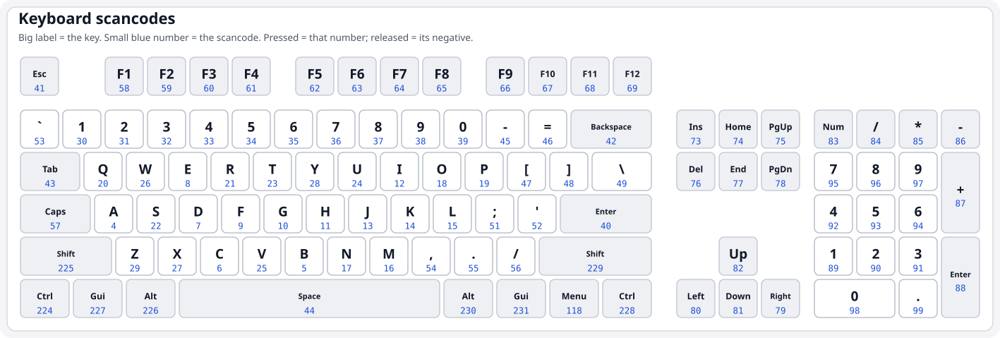

# The Napkin

If you are reading this, you have probably discovered a capsule from the early 21st century - a long list of numbers, maybe etched onto a titanium cylinder. These instructions explain how to bring those numbers to life. What follows is a complete description of a computing machine. The numbers on the cylinder are a program for it.

## How to Run the Numbers

You need a large collection of **slots**, each holding one **signed whole number**, ranging from −2,147,483,648 to +2,147,483,647. Number the slots starting from 0. You need 402,653,184 slots, all initially holding the number zero.

Copy the numbers from the cylinder into the slots in order, starting with slot[0]. "slot[x]" means "the number currently stored in slot number x."

Maintain a single number called **P** ("where you are"). It starts at 0.

To run the program, repeat these 4 steps in a loop:

### 1. Read Three Numbers

Read three addresses - call them **A**, **B**, **C** - by performing the following procedure three times in succession (once for A, once for B, once for C):

1. Look at slot[P]. Call this number **D**.
2. Advance P by one.
3. Check whether **D** is even or odd:
   - If **even**: the address is **D ÷ 4** (integer division, discarding any remainder).
   - If **odd**: look up slot[D ÷ 4], then divide *that* number by 4. The result is the address.

You now have three addresses: **A**, **B**, **C**. If, after reading the three addresses, **C = 0**, stop, as this means the program is complete.

### 2. Execute

- **If A = −1**: Read one keyboard event from the human operator and place a number representing it into slot[B]. If no keyboard event is waiting, place 0. A key being pressed is reported as a positive number; the same key being released is reported as the negative of that number. The number is the key's physical scancode: the USB HID Keyboard/Keypad usage ID, not the letter printed on the key, so it does not change with keyboard layout.

  For a common keyboard, the scancode of every key is drawn below. On each key, the large symbol is the marking printed on it, and the small number beneath is that key's scancode:

  

- **If B = −1**: Display slot[A] as one character of text to the human operator.

- **Otherwise**:
  - If A = 64: fill slots 64, 65, and 66 with the current time, as follows. Count the number of seconds since midnight on January 1st, 1970. Place the remainder of dividing that count by 4,294,967,296 into slot 64, and the whole-number result of that same division into slot 65. Place the number of nanoseconds past the current second (0 to 999,999,999) into slot 66.
  - **Subtract**: slot[B] ← slot[B] − slot[A].
  - **Branch**: if slot[B] is now ≤ 0, set P to C. (Otherwise, P stays where it already is - just past the three values you read.)

### 3. Interrupt

Keep a counter. Each time you perform the subtract-and-branch, increment it. When it exceeds 800,000 **and** slot[0] is not zero:

1. Store the current P × 4 into slot[1].
2. Set P to slot[0] ÷ 4.
3. Reset the counter to 0.

### 4. Display (for visual programs)

The cylinder may contain a visual program. Slots 402,243,584 through 402,653,183 (the last 409,600 slots) form a grid of 800 columns × 512 rows of picture elements. Each slot is one element encoded as a color: divide the number by 65,536 and take the remainder after dividing by 256 - that is the red intensity (0–255). Divide the original number by 256 and take the remainder after dividing by 256 - that is green. The remainder of the original number after dividing by 256 is blue. The first 800 slots are the top row, the next 800 the second row, and so on. Render this grid to a visual surface roughly 30 times per second.
